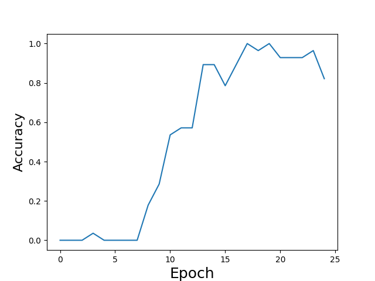
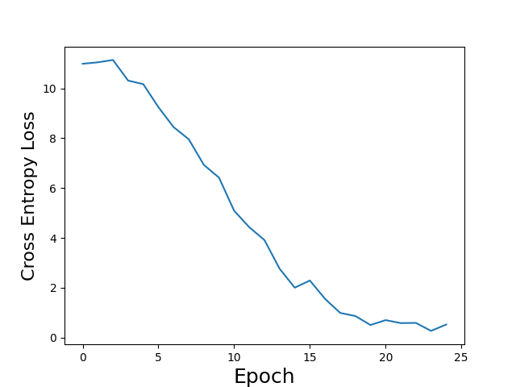

# InceptionV3 Model in Pytorch


I am using the dog/cats dataset (https://www.kaggle.com/chetankv/dogs-cats-images) to retrain the model. To train the model run the script trainModel.py.
Please note that due to limited CPU capacity and not using cuda(), number of images passed through the NN at once is limited. 
Make sure to have the training pictures in folder /training_set/cats and /training_set/dogs and test pictures in folder /test_set/cats and /test_set/dogs.

If you run the runModelonExamplePic.py file, the model predicts if the provided example picture (which is my families cat) is a cat or dog.
For both picture it outputs:
```
This is a cat
``` 
In training, accuracy converges to near 1, cross entropy loss to near 0. In test set, accuracy is at 96.6%. 
The training plots are as follows: 

## Training Accuracy Plot


## Training Cross Entropy Loss Plot


