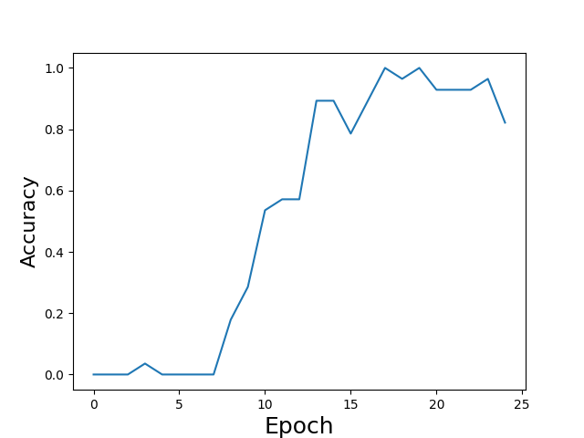
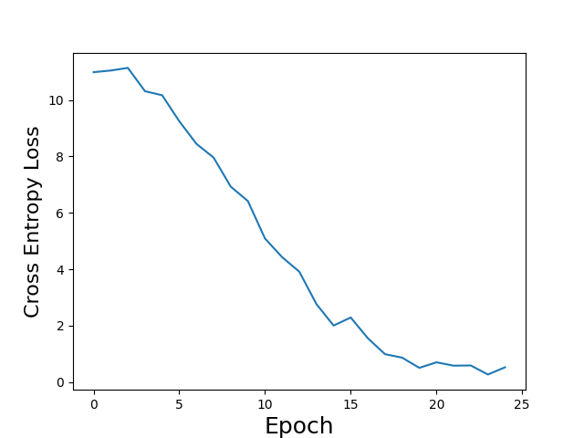

# InceptionV3 Model in Pytorch

I am using the dog/cats dataset to train the model. To train the model run the script trainModel.py. 
Make sure to have the training picture in foler /training_set/training_set/cats and /training_set/training_set/dogs.
The training plots are as follow:

## Training Accuracy Plot

## Training Cross Entropy Loss Plot

